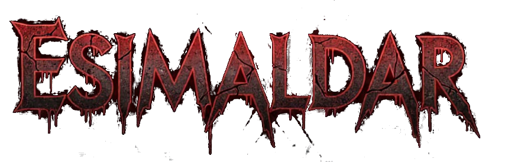
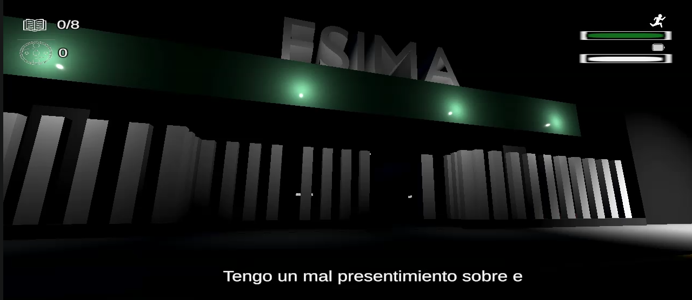
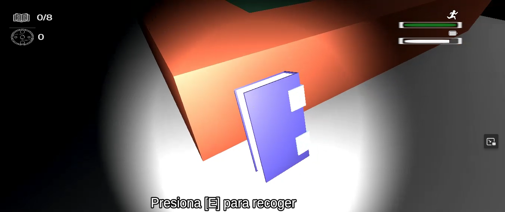

# 🎮 Esimaldar

  

---

## 📖 Descripción
Un juego clásico de terror ambientado en una escuela, debes adentrarte a las instalaciones durante la noche para poder recuperar tus libros que has olvidado, pero te das cuenta que mientras más permaneces dentro, cosas sobrenaturales suceden y debes mantenerte alerta.

---

## 🖼️ Capturas de Pantalla

  

---

## 🚀 Características Principales
- ✅ Mecánicas de juego destacadas
- 🎥 Sistema de cámara dinámico
- 🔊 Audio inmersivo con transiciones suaves
- 🌍 Escenarios 3D
- 🕹️ Compatible con teclado

---

## 🛠️ Tecnologías Utilizadas
| Tecnología | Uso |
|------------|-----|
| Unity      | Motor principal |
| C#         | Scripts |
| TextMeshPro| UI avanzada |
| Cinemachine| Control de cámara |

---